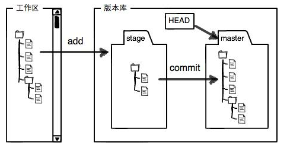

## Git_Note
### 常用命令
  #### 初始化仓库
  * `git init` 初始化一个Git仓库(将文件夹和Git关联)。  
  * `git add <file>` 将文件交给Git管理。  
  * `git commit -m <message>` 将文件(修改)提交到本地Git仓库。  
  * `git status` 查看工作区文件状态(是否有修改)。
  * `git diff` 查看修改的内容。
  #### 版本管理
  * `git reset --hard <commit_id>` 版本之间切换。
  * `git log --pretty=oneline --abbrev-commit` 简化查看提交log。
  * `git reflog` 查看所有历史提交log。回退后也可以看到会退前的提交log。
  #### 核心概念
  * **工作区(Working Directory)** 项目所在目录(git init时所在文件夹)。
  * **版本库（Repository）** 工作区中有一个隐藏目录`.git`，这个目录不算工作区，是Git的版本库。Git的版本库里存了很多东西，其中最重要的就是称为**stage（或者叫index）的暂存区**，还有Git为我们自动创建的第一个分支**master**，以及指向master的一个指针叫HEAD。  
  * **git add** 是将文件(修改)添加到暂存区。  
  * **git commit** 是将暂存区的修改提交到master分支。
  * **git push** 是将本地master分支上的修改提交到远程分支。
  * **修改管理** 文件的修改后没`git add`直接执行`git commit`，文件的修改不会被提交到master(本地)，只有添加到暂存区的修改，执行`git commit` 才会被提交到master(本地)。 
  >
  #### 删除文件
  * `rm(Linux命令)` 手动删除工作区文件，可通过`git rm <file>` 提交到暂存区，或者通过`git checkout -- <file>` 撤销工作区修改。  
  * `git rm <file>` 把工作区中文件删除并提交到暂存区。
  #### 撤销修改
  * `git checkout -- <file>` 撤销工作区中的修改。  
  * `git reset head` 把暂存区中的修改还原到工作区中。  
  * `git reset --hard <commit_id>` 切换版本
  > 1.仅在工作区中的修改
  > >`git checkout -- <file>` 撤销工作区中的修改。  
  > >
  > 2.撤销在暂存区的修改(执行了`git add`)  
  > > 先执行`git reset head` 把暂存区中的修改还原到工作区，然后执行`git checkout -- <file>`撤销工作区中修改。  
  > > 
  > 3.撤销提交到本地master的修改
  > > 先执行`git reset --hard <commit_id>` 把版本回退到暂存区时状态(执行`git commit`之前)，再执行`git reset head` 把暂存区中修改还原到工作区，最后执行`git checkout -- <file>` 撤销工作区修改。 
  #### 本地仓库与远程仓库
  * `git remote -v` 查看远程库信息。
  * `git push <origin(远程仓库名字)> <branch-name>` push 本地分支到远程分支, push前最好养成先pull的习惯，因为当远程的版本比你push的新的话，push会失败。
  * `git checkout -b <branch-name> <origin/branch-name>` 在本地创建和远程分支关联的分支。
  * `git branch --set-upstream <branch-name> <origin/branch-name>`  把本地分支和远程分支建立关联关系。
  * `git clone <github中仓库地url或者SSH key>` 克隆远程仓库到执行此命令的目录中。 
  * `git remote add <远程仓库name> <github中仓库地url或者SSH key>` 在本地仓库中只想此命令，将本地仓库和远程仓库关联。     
  #### 分支管理
  * `git branch` 查看分支，会显示所有分支，\*标识当前head所指分支。  
  * `git branch <branch_name>` 创建分支。 
  * `git branch -d <branch_name>` 删除分支(删除一个未合并过的分支参数d要用大写D)。   
  * `git checkout <branch_name>` 或者 `git switch <branch_name>` 切换分支。    
  * `git checkout -b <branch_name>` 或者 `git switch -c <branch_name>` 创建并且切换到创建的分支。  
  * `git merge <branch_name(合并的差异来源分支)>` 把branch_name分支中和当前分支差异的内容merge到当前分支中，采用的fast forward合并模式。   
  * `git merge --no-ff <branch_name(合并的差异来源分支)>` 合并分支时，加上--no-ff参数就可以用普通模式合并，合并后的历史有分支，能看出来曾经做过合并，而fast forward合并就看不出来曾经做过合并。  
  #### 保存工作区内容
  * `git stash` 把当前工作区中未提交的修改存储起来(可以多次stash)。此时，`git status`查看工作区是干净的。  
  * `git stash list` 查看存储的修改。
  * `git stash apply <stash@{index(list中下标)}>` 恢复存储的修改，但是，存储的内容不清除。可用`git stash drop <stash@{index(list中下标)}>` 清除存储。    
  * `git stash pop` 恢复存储中的修改，并删除存储。  
  * `git cherry-pick <commit_id>` 从其他分支复制commit_id提交的修改内容到当前分支。  
  #### 标签管理
  * `git tag -a <tag_name> -m "description" <commit_id>` 创建标签,不指定commit_id时创建最新head所指提交。
  * `git tag` 查看所有标签。
  * `git show <tag_name>` 显示标签详细信息。
  * `git push origin <tagname>` 推送指定tag到远程。
  * `git push origin --tags` 推送所有tag到远程。
  * `git tag -d <tagname>` 删除指定tag。
  * `git push origin :refs/tags/<tagname>` 删除远程tag(如果要删除push后的tag，先删除本地，再删除远程。)。
### Git_Collection
  * [Git 基础教程](https://www.liaoxuefeng.com/wiki/896043488029600)
  
